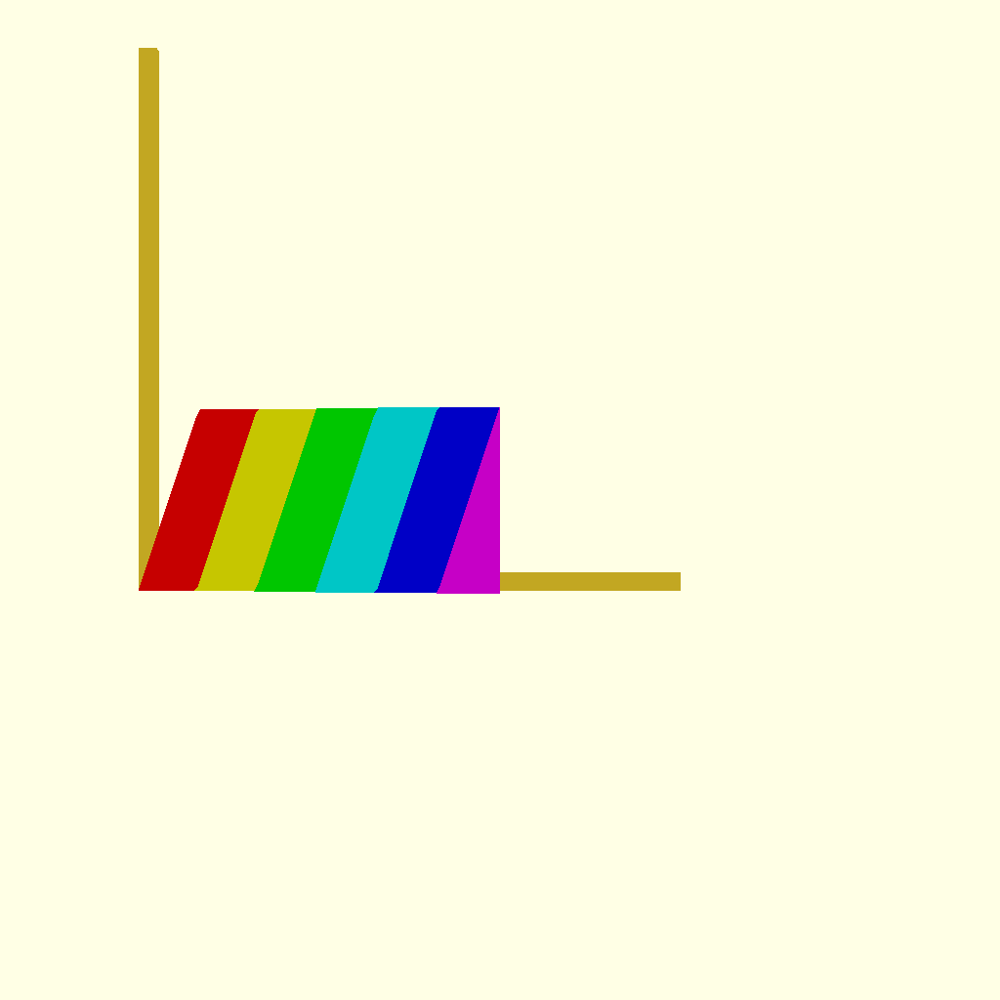
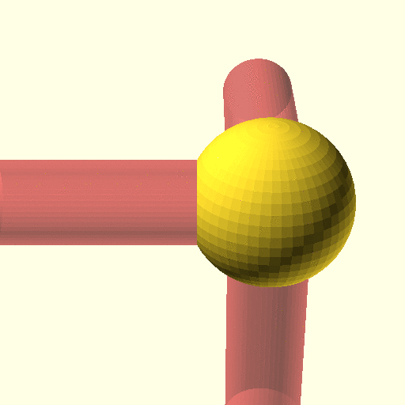

# time_steps() function

Function that return an array of steps to be use in animations the same way we use $t

example for t=time_steps(4)
- when $t grows from 0    to 0.25 , t[0] grows from 0 ot 1
- when $t grows from 0.25 to 0.5  , t[1] grows from 0 ot 1
- when $t grows from 0.5  to 0.75 , t[2] grows from 0 ot 1
- when $t grows from 0.75 to 1    , t[3] grows from 0 ot 1

graphical display of 6 steps

(X is the time $t, Y is the value, each color is the curve of each step)

## prototype

### function time_steps(nb_step)

- Parameter `nb_step` **integer number**: number of steps. It must be > 0
- Returns array of float number: it has a length of nb_step and contain a number between 0 and 1

 This function just call `t_steps()`  with `$t`.

### function t_steps(t, nb_step)

It the same as `time_steps(nb_step)` but you can 

* Parameter t float number: the time
* Parameter nb_step integer number: number of steps. It must be > 0
* Returns array of float number: it has a length of nb_step and contain a number between 0 and 1

## example of animation

 
